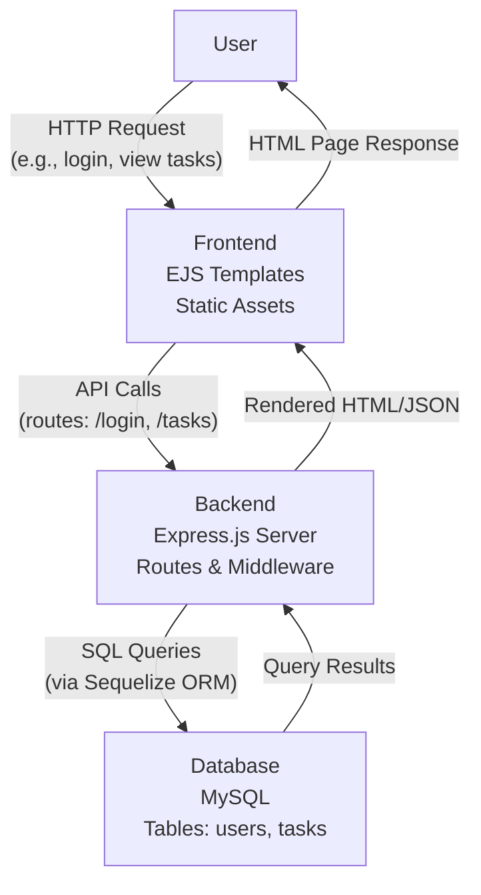

# Express Task Management Application

A Node.js web application built with Express.js for managing tasks and user authentication. This application provides a dashboard for users to create, view, edit, and delete tasks, along with user profile management.

## Features

- User registration and login with JWT authentication
- Task management (Create, Read, Update, Delete)
- User dashboard with task overview
- User profile management (view, edit, change password)
- Secure API endpoints with middleware
- Responsive UI using Bootstrap-based theme
- MySQL database integration with Sequelize ORM

## Technologies Used

- **Backend**: Node.js, Express.js
- **Database**: MySQL with Sequelize ORM
- **Authentication**: JSON Web Tokens (JWT), bcrypt for password hashing
- **Frontend**: EJS templating engine, Bootstrap CSS framework
- **Security**: Helmet for security headers, CORS
- **Development**: Nodemon for development server

## Architecture

The application follows a standard three-tier web architecture:

- **Frontend**: Handles user interface and interactions using EJS templates and static assets.
- **Backend**: Manages business logic, routing, authentication, and API endpoints with Express.js.
- **Database**: Stores user and task data using MySQL with Sequelize ORM.

### Architecture Diagram




*Note: The FlowDiagram.png image can be generated by copying the Mermaid code above into a tool like [Mermaid Live Editor](https://mermaid.live) and exporting as PNG.*

## Prerequisites

- Node.js (v14 or higher)
- MySQL Server
- npm or yarn

## Installation

1. **Clone the repository:**
   ```bash
   git clone <repository-url>
   cd express
   ```

2. **Install dependencies:**
   ```bash
   npm install
   ```

3. **Set up environment variables:**
   Create a `.env` file in the root directory with the following variables:
   ```env
   APP_PORT=3000
   JWT_SECRET=your_jwt_secret_key
   DB_HOST=localhost
   DB_USER=root
   DB_PASSWORD=your_mysql_password
   DB_NAME=your_database_name
   ```

4. **Set up the database:**
   - Create a MySQL database with the name specified in `DB_NAME`
   - The application will automatically sync the database schema on startup

## Usage

1. **Start the development server:**
   ```bash
   npm run dev
   ```

2. **Start the production server:**
   ```bash
   npm start
   ```

3. **Access the application:**
   Open your browser and navigate to `http://localhost:3000`

## API Endpoints

The application provides RESTful API endpoints for authentication and task management. You can test these using tools like Postman or the included `req.rest` file.

### Authentication Routes
- `GET /` - Login page
- `POST /login` - User login
- `GET /register` - Registration page
- `POST /register` - User registration
- `POST /logout` - User logout

### Dashboard Routes
- `GET /dashboard` - User dashboard

### Task Routes
- `GET /dashboard/tasks` - List all tasks
- `GET /dashboard/tasks/create` - Create task form
- `POST /dashboard/tasks` - Create new task
- `GET /dashboard/tasks/:id/edit` - Edit task form
- `PUT /dashboard/tasks/:id` - Update task
- `DELETE /dashboard/tasks/:id` - Delete task

### User Routes
- `GET /dashboard/profile` - User profile
- `GET /dashboard/profile/edit` - Edit profile form
- `PUT /dashboard/profile` - Update profile
- `GET /dashboard/profile/changepassword` - Change password form
- `PUT /dashboard/profile/changepassword` - Change password

## Project Structure

```
express/
├── src/
│   ├── app.js                 # Main application file
│   ├── config/
│   │   ├── database.js        # Database configuration
│   │   └── env.js             # Environment variables
│   ├── jwt/
│   │   └── token.js           # JWT utilities
│   ├── middleware/
│   │   └── auth.js            # Authentication middleware
│   ├── models/
│   │   ├── index.js           # Database models index
│   │   ├── Task.js            # Task model
│   │   └── User.js            # User model
│   ├── public/                # Static assets
│   ├── routes/
│   │   ├── auth.js            # Authentication routes
│   │   ├── dashboard.js       # Dashboard routes
│   │   ├── task.js            # Task routes
│   │   └── user.js            # User routes
│   └── views/                 # EJS templates
├── package.json
├── .env                       # Environment variables (create this)
├── req.rest                   # API testing file
└── README.md
```

## Development

- Use `npm run dev` for development with auto-restart
- The application uses Sequelize for database operations
- Views are rendered using EJS templating
- Static files are served from the `public/` directory

## Security

- Passwords are hashed using bcrypt
- JWT tokens are used for session management
- Helmet is used to set security headers
- CORS is configured for cross-origin requests

## Contributing

1. Fork the repository
2. Create a feature branch (`git checkout -b feature/new-feature`)
3. Commit your changes (`git commit -am 'Add new feature'`)
4. Push to the branch (`git push origin feature/new-feature`)
5. Create a Pull Request

## License

This project is licensed under the ISC License.

## Troubleshooting

- **Database connection issues**: Ensure MySQL is running and the credentials in `.env` are correct
- **Port already in use**: Change the `APP_PORT` in `.env` or stop other services using port 3000
- **JWT errors**: Ensure `JWT_SECRET` is set in `.env`
- **Module not found**: Run `npm install` to install all dependencies

For more details, check the application logs in the terminal.